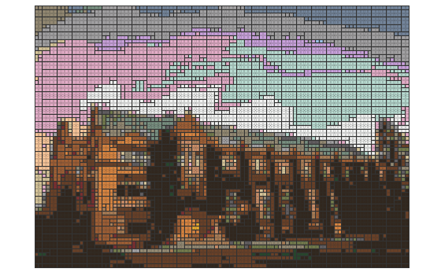
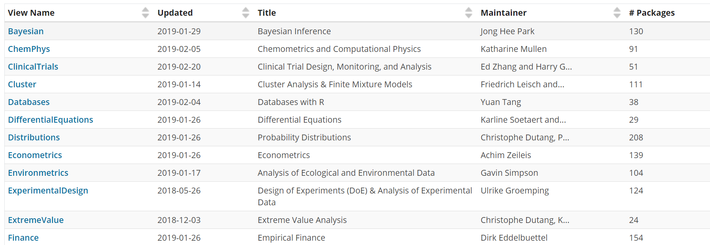

```{r setup, include=FALSE,echo=FALSE}
knitr::opts_chunk$set(echo = FALSE)
```


```{r eval=FALSE, include=FALSE}
setwd("C:/Users/jpiaskowski/Documents/GitHub/LEGOMosaics/")
library(jpeg)
source("0_Functions.R")

mosaic1 <- readJPEG("C:/Users/jpiaskowski/Documents/GitHub/r-novice-AgScience/fig/UI_admin.jpg") %>% 
  #scale_image(c(100, 70)) %>%
  legoize() %>% 
  collect_bricks() 

mosaic1 %>% display_set()
```


```{r, out.width="600px"}


```


### Why Learn R? 
#### Do Fun Things 

```{r, out.width="650px"}

```

### Why Learn R? 
#### Access Rich Package Ecosystem

```{r, out.width="650px"}

```


### Why Learn R? 
#### Do Reproducible Research

```{r, out.width="700px",fig.margin=TRUE}
knitr::include_graphics("../fig/wrong_data2.PNG")
```

>**Reproducible research**: with the same data and scripts, your results can be recreated independently.  


### Why Learn R? 
#### Document Your Workflow

```{r, out.width="700px"}
knitr::include_graphics("../fig/bad_data.PNG")
```

### Why Learn R? 
#### Clear File History & More Reproducible

```{r, out.width="700px"}
knitr::include_graphics("../fig/bad_file_mgmt.PNG")
```

### Learning Objectives

After participating in this 4-hour R workshop, you will:
 
* Be familiar with RStudio
* Know the basic rules of R
* Understand how to access and use the help files in R
* Be able to call and wriete R functions
* Understand different data types in R
* Understand the major object types in R: data frames, vectors
* Be able to import and export data
* Be capable of basic plotting features: hist(), boxplot(), plot().
* Be capable of basic data manipulation: column selection, row selection, filtering, sorting, simple summary statistics


